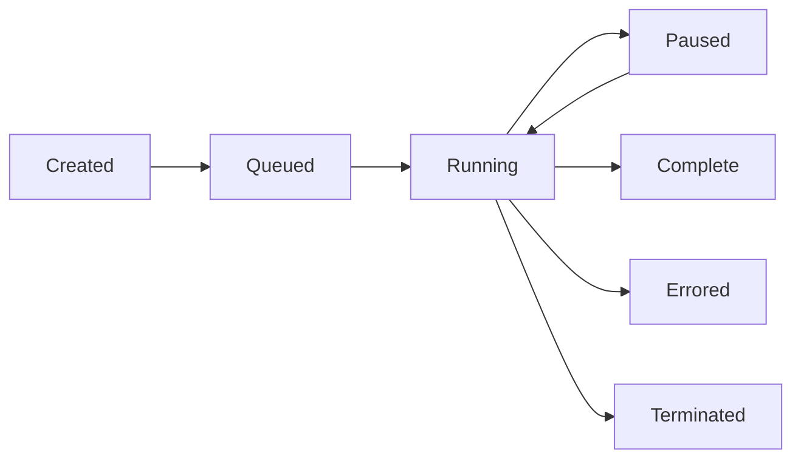

# Workflow Instance Management

Complete reference for creating, monitoring, and managing Workflow instances.

## Creating Instances

### Basic Creation

```typescript
const instance = await env.MY_WORKFLOW.create();
```

Creates a workflow instance with an auto-generated ID.

### Creation with Parameters

```typescript
const instance = await env.MY_WORKFLOW.create({
  params: {
    userId: '12345',
    action: 'process',
    metadata: { priority: 'high' },
  },
});
```

**Parameters**:
- Available in workflow via `event.payload`
- Must be JSON-serializable
- Type-safe when using TypeScript generics

### Creation with Custom ID

```typescript
const instance = await env.MY_WORKFLOW.create({
  id: crypto.randomUUID(), // or any unique string
  params: { /* ... */ },
});
```

**ID requirements**:
- Must be unique across all instances
- Use for idempotent creation (same ID won't create duplicate)
- Good for correlating with external systems

### Idempotent Creation

```typescript
// Safe to call multiple times - uses same ID
const orderId = 'order-12345';

const instance = await env.MY_WORKFLOW.create({
  id: orderId,
  params: { orderId },
});

// Calling again with same ID returns existing instance
const sameInstance = await env.MY_WORKFLOW.create({
  id: orderId,
  params: { orderId },
});

console.log(instance.id === sameInstance.id); // true
```

## Retrieving Instances

### Get by ID

```typescript
const instance = await env.MY_WORKFLOW.get('instance-id');

if (!instance) {
  return new Response('Workflow not found', { status: 404 });
}
```

**Returns**: `WorkflowInstance` or `null` if not found

### Instance Properties

```typescript
const instance = await env.MY_WORKFLOW.get(id);

console.log(instance.id); // Instance identifier
```

## Instance Status

### Checking Status

```typescript
const instance = await env.MY_WORKFLOW.get(id);
const status = await instance.status();

console.log(status);
```

**Status response structure**:
```typescript
{
  status: 'queued' | 'running' | 'paused' | 'complete' | 'errored' | 'terminated' | 'unknown';
  error?: string;           // Present if status is 'errored'
  output?: any;             // Workflow return value if complete
  // Additional metadata may be included
}
```

### Status Values

| Status | Description |
|--------|-------------|
| `queued` | Created but not yet started |
| `running` | Currently executing steps |
| `paused` | Suspended (e.g., during sleep) |
| `complete` | Successfully finished |
| `errored` | Failed with unrecoverable error |
| `terminated` | Manually terminated |
| `unknown` | Status cannot be determined |

### Polling for Completion

```typescript
async function waitForCompletion(
  workflow: Workflow,
  instanceId: string,
  timeoutMs: number = 60000
): Promise<any> {
  const startTime = Date.now();
  
  while (Date.now() - startTime < timeoutMs) {
    const instance = await workflow.get(instanceId);
    const status = await instance.status();
    
    if (status.status === 'complete') {
      return status.output;
    }
    
    if (status.status === 'errored') {
      throw new Error(`Workflow failed: ${status.error}`);
    }
    
    // Poll every 2 seconds
    await new Promise(resolve => setTimeout(resolve, 2000));
  }
  
  throw new Error('Workflow timeout');
}

// Usage
const instance = await env.MY_WORKFLOW.create({ params });
const result = await waitForCompletion(env.MY_WORKFLOW, instance.id);
```

## Workflow Return Values

### Returning Data from Workflow

```typescript
export class MyWorkflow extends WorkflowEntrypoint<Env, Params> {
  async run(event: WorkflowEvent<Params>, step: WorkflowStep) {
    const result = await step.do('process', async () => {
      return { processed: true };
    });
    
    // Return value is available in status.output
    return {
      success: true,
      data: result,
      timestamp: Date.now(),
    };
  }
}

// In Worker
const instance = await env.MY_WORKFLOW.create({ params });

// Poll until complete
let status;
do {
  await new Promise(r => setTimeout(r, 1000));
  status = await (await env.MY_WORKFLOW.get(instance.id)).status();
} while (status.status === 'running');

console.log(status.output); // { success: true, data: {...}, timestamp: ... }
```

## Instance Lifecycle

### Lifecycle States



### State Transitions

**Created → Queued**:
- Instance created via `create()`
- Waiting for execution slot

**Queued → Running**:
- Workflow starts executing
- `run()` method is called

**Running → Paused**:
- Hit `step.sleep()` call
- Workflow suspended until sleep expires

**Paused → Running**:
- Sleep duration elapsed
- Execution resumes

**Running → Complete**:
- `run()` method completes successfully
- Return value stored in status

**Running → Errored**:
- Unhandled error in workflow
- All retry attempts exhausted

## Integration Patterns

### Fire and Forget

```typescript
export default {
  async fetch(req: Request, env: Env): Promise<Response> {
    // Start workflow without waiting
    await env.MY_WORKFLOW.create({
      params: await req.json(),
    });
    
    return new Response('Workflow started', { status: 202 });
  },
};
```

**Use when**: Client doesn't need to wait for completion

### Synchronous Response

```typescript
export default {
  async fetch(req: Request, env: Env): Promise<Response> {
    const instance = await env.MY_WORKFLOW.create({
      params: await req.json(),
    });
    
    // Wait for completion (with timeout)
    const timeoutMs = 30000;
    const startTime = Date.now();
    
    while (Date.now() - startTime < timeoutMs) {
      const status = await (await env.MY_WORKFLOW.get(instance.id)).status();
      
      if (status.status === 'complete') {
        return Response.json(status.output);
      }
      
      if (status.status === 'errored') {
        return Response.json(
          { error: status.error },
          { status: 500 }
        );
      }
      
      await new Promise(r => setTimeout(r, 500));
    }
    
    return Response.json(
      { error: 'Timeout', instanceId: instance.id },
      { status: 202 }
    );
  },
};
```

**Use when**: Need immediate result, with timeout fallback

### Status Endpoint Pattern

```typescript
export default {
  async fetch(req: Request, env: Env): Promise<Response> {
    const url = new URL(req.url);
    
    // POST /workflow - Create new instance
    if (req.method === 'POST' && url.pathname === '/workflow') {
      const instance = await env.MY_WORKFLOW.create({
        id: crypto.randomUUID(),
        params: await req.json(),
      });
      
      return Response.json({
        instanceId: instance.id,
        statusUrl: `/workflow/${instance.id}`,
      });
    }
    
    // GET /workflow/:id - Get status
    if (req.method === 'GET' && url.pathname.startsWith('/workflow/')) {
      const id = url.pathname.split('/')[2];
      const instance = await env.MY_WORKFLOW.get(id);
      
      if (!instance) {
        return Response.json({ error: 'Not found' }, { status: 404 });
      }
      
      const status = await instance.status();
      return Response.json(status);
    }
    
    return new Response('Not found', { status: 404 });
  },
};
```

**Use when**: Long-running workflows, client polls for updates

### Webhook Callback Pattern

```typescript
type Params = {
  data: any;
  callbackUrl: string;
};

export class MyWorkflow extends WorkflowEntrypoint<Env, Params> {
  async run(event: WorkflowEvent<Params>, step: WorkflowStep) {
    const result = await step.do('process', async () => {
      // Do work
      return { processed: true };
    });
    
    // Send callback on completion
    await step.do('send callback', async () => {
      await fetch(event.payload.callbackUrl, {
        method: 'POST',
        headers: { 'Content-Type': 'application/json' },
        body: JSON.stringify({
          instanceId: event.instanceId,
          result,
        }),
      });
    });
    
    return result;
  }
}

// Worker creates workflow with callback URL
await env.MY_WORKFLOW.create({
  params: {
    data: { /* ... */ },
    callbackUrl: 'https://myapp.com/webhook/workflow-complete',
  },
});
```

**Use when**: Async notification required on completion

## Error Scenarios

### Handling Missing Instances

```typescript
const instanceId = url.searchParams.get('id');
const instance = await env.MY_WORKFLOW.get(instanceId);

if (!instance) {
  return Response.json(
    { error: 'Workflow instance not found' },
    { status: 404 }
  );
}
```

### Handling Errored Workflows

```typescript
const instance = await env.MY_WORKFLOW.get(id);
const status = await instance.status();

if (status.status === 'errored') {
  return Response.json({
    error: 'Workflow failed',
    message: status.error,
    instanceId: id,
  }, { status: 500 });
}
```

### Timeout Handling

```typescript
async function createWithTimeout(
  workflow: Workflow,
  params: any,
  timeoutMs: number
): Promise<any> {
  const instance = await workflow.create({ params });
  const startTime = Date.now();
  
  while (Date.now() - startTime < timeoutMs) {
    const status = await (await workflow.get(instance.id)).status();
    
    if (status.status === 'complete') {
      return status.output;
    }
    
    if (status.status === 'errored') {
      throw new Error(status.error);
    }
    
    await new Promise(r => setTimeout(r, 1000));
  }
  
  // Return instance ID for later polling
  throw new Error(JSON.stringify({
    timeout: true,
    instanceId: instance.id,
    message: 'Workflow still running',
  }));
}
```

## Best Practices

### Instance ID Strategy

**Use auto-generated IDs when**:
- Each request should create a new workflow
- No need for external correlation

**Use custom IDs when**:
- Idempotent creation required
- Need to correlate with external system (order ID, user ID, etc.)
- Client may retry requests

```typescript
// Idempotent based on order
const orderId = req.headers.get('X-Order-ID');

await env.MY_WORKFLOW.create({
  id: `order-${orderId}`,
  params: { orderId },
});
```

### Status Polling

**Do**:
- Use exponential backoff for polling
- Set reasonable timeouts
- Handle all status states

**Don't**:
- Poll too frequently (< 500ms intervals)
- Poll forever without timeout
- Ignore error states

### Parameter Design

**Keep params small**:
```typescript
// ✅ Good - pass references
await env.MY_WORKFLOW.create({
  params: {
    userId: '123',
    orderId: '456',
  },
});

// ❌ Bad - large data in params
await env.MY_WORKFLOW.create({
  params: {
    largeDocument: '...10MB of data...',
  },
});
```

**Store large data separately**:
```typescript
// Store in KV/R2, pass reference
const key = crypto.randomUUID();
await env.KV.put(key, largeData);

await env.MY_WORKFLOW.create({
  params: { dataKey: key },
});

// In workflow
const data = await this.env.KV.get(event.payload.dataKey);
```

### Monitoring

```typescript
// Log instance creation
const instance = await env.MY_WORKFLOW.create({ params });
console.log('Workflow created:', {
  instanceId: instance.id,
  params,
  timestamp: new Date().toISOString(),
});

// Log status checks
const status = await instance.status();
console.log('Workflow status:', {
  instanceId: instance.id,
  status: status.status,
  timestamp: new Date().toISOString(),
});
```

## Multiple Workflow Types

Configure multiple workflows in `wrangler.jsonc`:

```jsonc
{
  "workflows": [
    {
      "name": "order-processing",
      "binding": "ORDER_WORKFLOW",
      "class_name": "OrderProcessor"
    },
    {
      "name": "user-onboarding",
      "binding": "ONBOARDING_WORKFLOW",
      "class_name": "UserOnboarding"
    }
  ]
}
```

Access in Worker:

```typescript
type Env = {
  ORDER_WORKFLOW: Workflow;
  ONBOARDING_WORKFLOW: Workflow;
};

// Create order workflow
await env.ORDER_WORKFLOW.create({ params: { orderId } });

// Create onboarding workflow
await env.ONBOARDING_WORKFLOW.create({ params: { userId } });
```
